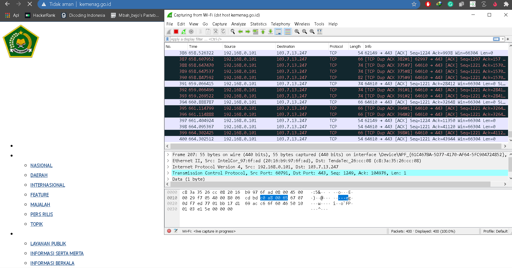

# Jarkom-Modul-1-A11-2021

## Soal 1
Sebutkan webserver yang digunakan pada "ichimarumaru.tech"

1. filter menggunakan `http.host == "ichimarumaru.tech"`
2. kemudian pilih salah satu paket, klik kanan, pilih `Follow > TCP Stream` dan akan terlihat bahwa server yang digunakan adalah `nginx/1.18.0 (ubuntu)` dengan port tujuannya adalah port 80.


## Soal 2
Temukan paket dari web-web yang menggunakan basic authentication method!

1. filter menggunakan `http.authbasic`
2. kemudian pilih salah satu paket, lalu expand pada bagian `Hypertext Transfer Protocol`, dan dapat dilihat bahwa hostnya adalah `basic.ichimarumaru.tech`.


## Soal 3
Ikuti perintah di basic.ichimarumaru.tech! Username dan password bisa didapatkan dari file .pcapng!

1. Pertama lakukan filter menggunakan `ip.dst == 167.172.77.139 && http.authorization` (ip dapat dilihat dari soal sebelumnya) sehingga tampil seluruh paket yang berasal dari basic.ichimarumaru.tech dan memiliki authorization.
2. Klik kanan pada salah satu paket kemudian expand pada bagian authorization.
3. Sehingga dapat dilihat bahwa usernamenya adalah `kuncimenujulautan` dan passwordnya adalah `tQKEJFbgNGC1NCZlWAOjhyCOm6o3xEbPkJhTciZN`


## Soal 4
Temukan paket mysql yang mengandung perintah query select

1. Lakukan filter dengan menggunakan `mysql.query && (mysql.query contains "select" ||  mysql.query contains "SELECT")`


## Soal 5
Login ke portal.ichimarumaru.tech kemudian ikuti perintahnya! Username dan password bisa didapat dari query insert pada table users dari file .pcap!

1. Lakukan filter dengan menggunakan `mysql.query && mysql.query contains "INSERT"`
2. Terlihat bahwa usernamenya adalah `akakanomi` dan passwordnya adalah `pemisah4lautan`


## Soal 8
Cari paket yang menunjukan pengambilan file dari FTP tersebut!

Solusi : Mencari pake yang menunjukan pengambilan sama halnya dengan men-*download* sehingga filter yang sesuai ialah ```ftp contains "RETR"```


## Soal 11
Filter sehingga wireshark hanya mengambil paket yang berasal dari port 80! 

Solusi: ```src port 80```


## Soal 12
Filter sehingga wireshark hanya mengambil paket yang mengandung port 21!

Solusi: ```port 21```


## Soal 13
Filter sehingga wireshark hanya menampilkan paket yang menuju port 443!

Solusi: ```dst port 443```


## Soal 14
Filter sehingga wireshark hanya mengambil paket yang tujuannya ke kemenag.go.id!

Solusi: ```dst host kemenag.go.id```



## Soal 15
Filter sehingga wireshark hanya mhanya mengambil paket yang berasal dari ip kalian!

Solusi:
Dengan menggunakan command prompt dan command ```ipconfig```. Dari situ, Ditemukan bahwa ip yang digunakan adalah ```192.168.0.101```. 
Kemudian untuk mengambil paket yang berasal dari ip, menggunakan capture filter: ```ip src 192.168.0.101``` 


